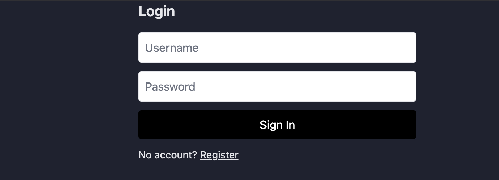
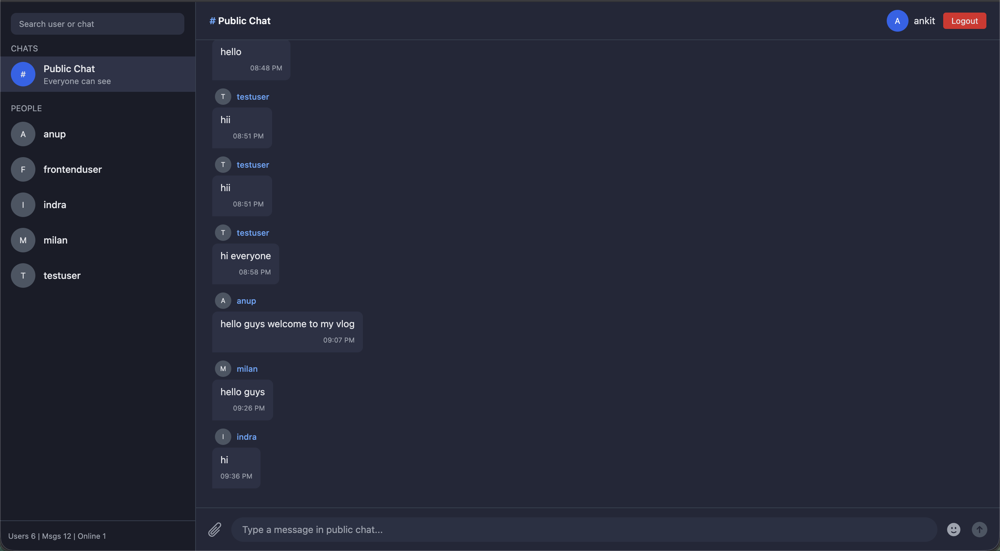
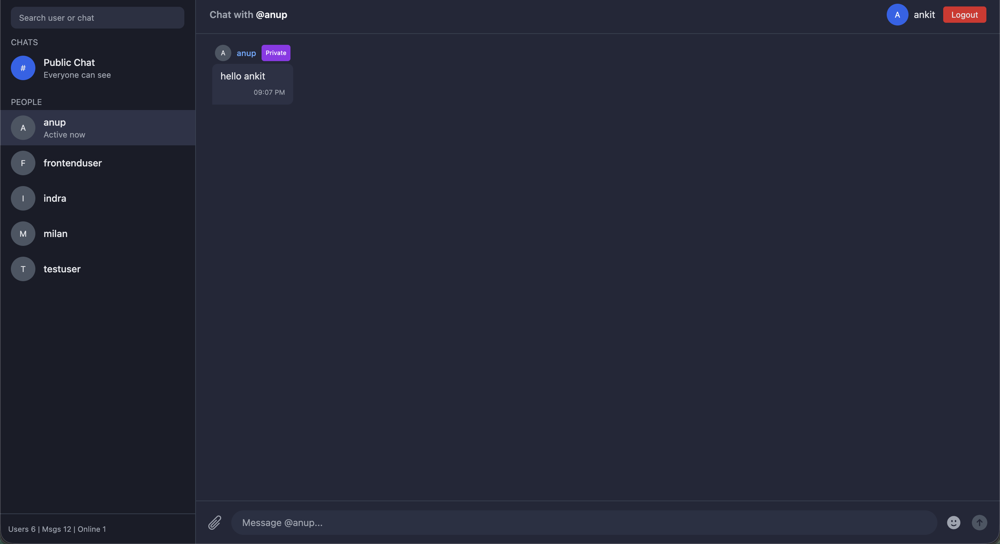

# 💬 Realtime Chat Application

<div align="center">


A modern, full-stack real-time chat application with public and private messaging capabilities.

[Features](#-features) • [Tech Stack](#-tech-stack) • [Getting Started](#-getting-started) • [Screenshots](#-screenshots) • [API Documentation](#-api-documentation)

</div>

---

## ✨ Features

### 🎯 Core Functionality
- **Real-time Messaging** - Instant message delivery using Socket.IO
- **Public Chat Rooms** - Chat with everyone in the public channel
- **Private Messaging** - One-on-one conversations with any user
- **User Authentication** - Secure JWT-based login system
- **Online Status** - See who's currently online
- **Message History** - Persistent chat history stored in database

### 🎨 User Experience
- **Modern Dark UI** - Sleek, Discord-inspired interface
- **Responsive Design** - Works on desktop, tablet, and mobile
- **Auto-scroll** - Messages automatically scroll to the latest
- **User Search** - Quickly find and chat with users
- **Real-time Stats** - Live count of users, messages, and online status
- **Message Timestamps** - See when each message was sent

### 🔒 Security
- **Password Hashing** - bcrypt encryption for secure password storage
- **JWT Tokens** - Stateless authentication
- **Protected Routes** - Middleware-based route protection
- **Input Validation** - Server-side validation for all inputs
- **CORS Protection** - Configured CORS for secure cross-origin requests

---

## 🛠 Tech Stack

### Frontend
- **React 18** - Modern UI library with hooks
- **TypeScript** - Type-safe development
- **Vite** - Lightning-fast build tool
- **Socket.IO Client** - Real-time communication
- **Axios** - HTTP client for API requests
- **Tailwind CSS** - Utility-first CSS framework
- **Heroicons** - Beautiful UI icons

### Backend
- **Node.js** - JavaScript runtime
- **Express** - Fast web framework
- **TypeScript** - Type-safe backend code
- **Socket.IO** - Real-time WebSocket server
- **Sequelize ORM** - Database management
- **MySQL** - Relational database
- **JWT** - JSON Web Tokens for auth
- **bcryptjs** - Password hashing
- **Helmet** - Security middleware
- **CORS** - Cross-origin resource sharing

---

## 🚀 Getting Started

### Prerequisites

Make sure you have the following installed:
- **Node.js** (v18 or higher) - [Download](https://nodejs.org/)
- **MySQL** (v8 or higher) - [Download](https://dev.mysql.com/downloads/)
- **npm** or **yarn** - Comes with Node.js

### Installation

#### 1️⃣ Clone the Repository

```bash
git clone https://github.com/yourusername/realtime-chat-app.git
cd realtime-chat-app


###2️⃣ Set Up the Database
# Login to MySQL
mysql -u root -p

# Create database
CREATE DATABASE realtime_chat CHARACTER SET utf8mb4 COLLATE utf8mb4_unicode_ci;

# Exit MySQL
EXIT;


###3️⃣ Backend Setup
# Navigate to server folder
cd server

# Install dependencies
npm install

# Create .env file
cp .env.example .env

# Edit .env with your credentials
nano .env


Backend .env Configuration:
# Server
PORT=5001
NODE_ENV=development

# Database
DB_HOST=localhost
DB_PORT=3306
DB_USER=root
DB_PASSWORD=your_password_here
DB_NAME=realtime_chat

# JWT
JWT_SECRET=your-super-secret-jwt-key-min-32-characters-long

# CORS
CORS_ORIGIN=http://localhost:5173


###4️⃣ Frontend Setup
# Navigate to client folder
cd ../client

# Install dependencies
npm install

# Create .env file
cp .env.example .env

# Edit .env
nano .env

Frontend .env Configuration:
# Development
VITE_API_URL=http://localhost:5001/api
VITE_SOCKET_URL=http://localhost:5001

# Production (uncomment when deploying)
# VITE_API_URL=https://your-api-domain.com/api
# VITE_SOCKET_URL=https://your-api-domain.com

###5️⃣ Run the Application
Terminal 1 - Backend:
cd server
npm run dev

Terminal 2 - Frontend:

cd client
npm run dev

The app will be running at:

Frontend: http://localhost:5173
Backend: http://localhost:5001
Health Check: http://localhost:5001/health


📸 Screenshots
Login Screen

Public Chat

Private Messaging


📁 Project Structure

realtime-chat-app/
├── client/                 # Frontend (React + TypeScript)
│   ├── src/
│   │   ├── components/    # Reusable UI components
│   │   ├── pages/         # Page components (Chat, Login, Register)
│   │   ├── api.ts         # API configuration
│   │   └── main.tsx       # App entry point
│   ├── .env               # Frontend environment variables
│   └── package.json
│
├── server/                # Backend (Node.js + TypeScript)
│   ├── src/
│   │   ├── config/        # Database configuration
│   │   ├── controllers/   # Route handlers
│   │   ├── middleware/    # Auth and other middleware
│   │   ├── models/        # Database models (User, Message)
│   │   ├── routes/        # API routes
│   │   ├── app.ts         # Express app setup
│   │   ├── index.ts       # Server entry point
│   │   └── socket.ts      # Socket.IO configuration
│   ├── .env               # Backend environment variables
│   └── package.json
│
└── README.md              


📝 License
This project is licensed under the MIT License - see the LICENSE file for details.


👨‍💻 Author
Your Name

GitHub: @yourusername
LinkedIn: Your Name
Email: your.email@example.com


🙏 Acknowledgments
Socket.IO for real-time communication
Sequelize for elegant ORM
Tailwind CSS for beautiful styling
Heroicons for UI icons
The open-source community


